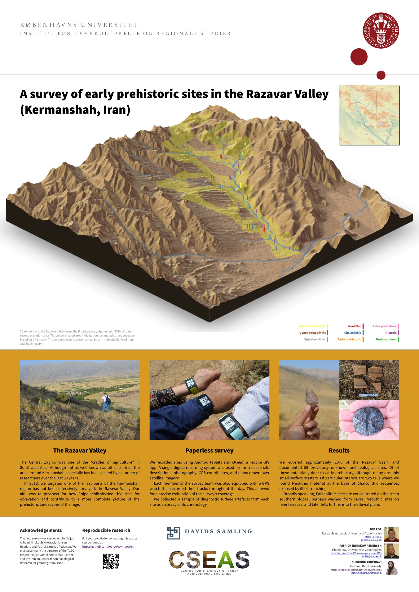

# A survey of early prehistoric sites in the Razavar Valley (Kermanshah, Iran)

*Joe Roe* <<jwg983@hum.ku.dk>>,1 *Patrick Nørskov Pedersen*,1 & *Shokouh Khosravi*2  
1 Centre for the Study of Early Agricultural Societies, University of Copenhagen  
2 Department of Archaeology, Razi University

This is the source repository for a poster on the preliminary results of the Razavar Valley Survey (2018), presented at the 2019 meeting of the British Association for Near Eastern Archaeology in Liverpool.

----

----

* [High resolution PDF](rzvr_poster.pdf) (77.4 MB)
